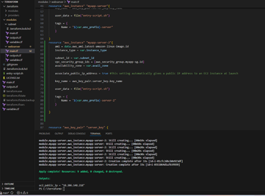
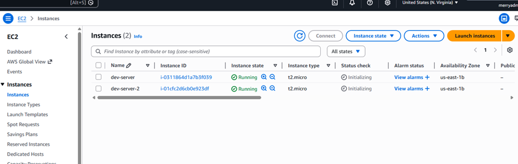
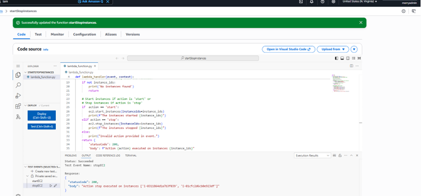
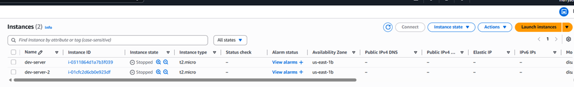
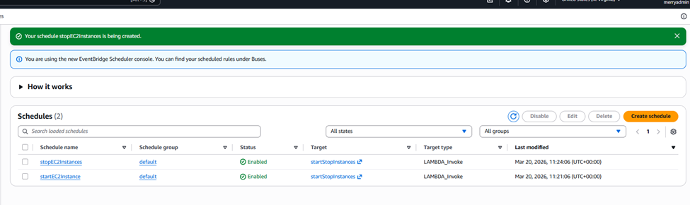

# ec2-auto-scheduler
Automated EC2 scheduling using AWS Lambda and EventBridge

Automated EC2 Start/Stop Using Lambda & EventBridge (Cost Optimization)

**Project Overview**
This project demonstrates a serverless solution to automate the start and stop of Amazon EC2 instances using Amazon Web Services services.
By scheduling instances to run only during business hours, this solution reduces unnecessary cloud costs and manual effort.
________________________________________
**Problem Statement**

Manually starting and stopping EC2 instances is inefficient and time-consuming.
This project automates the process using scheduled triggers, improving operational efficiency.
Technologies Used
•	Amazon EC2
•	AWS Lambda
•	Amazon EventBridge
•	Terraform
•	AWS IAM
•	Amazon CloudWatch
•	Python (Boto3)
________________________________________________

**Step 1: Provision EC2 Instances (Terraform)**

•	Created EC2 instances using Terraform
•	Ensured consistent and repeatable infrastructure setup

Screenshots:

•	Terraform configuration

•	EC2 instances running in console

________________________________________
**Step 2: Lambda Function (Automation Logic)**

Developed a Python Lambda function that:
•	Starts EC2 instances
•	Stops EC2 instances
•	Logs execution details to CloudWatch
IAM Roles:
•	AWSLambdaBasicExecutionRole (enables CloudWatch logging)
•	AmazonEC2FullAccess (used for demo purposes)
_⚠️ In production, this should be replaced with a least-privilege policy._
Testing:
•	Triggered Lambda manually
•	Verified EC2 instances changed state (running ↔ stopped)
•	Monitored execution logs in CloudWatch

Screenshots:

•	Lambda test execution
 
•	EC2 state after
 

________________________________________
**Step 3: EventBridge Scheduling**

Configured scheduled rules:
•	Start Instances
cron(07:00 * MON-FRI *)
•	Stop Instances
cron(18:00* MON-FRI *)
•	EventBridge triggers Lambda with input:
{ "action": "start" }
{ "action": "stop" }

Screenshots:
 
________________________________________
**Architecture Flow**

EventBridge (Schedule)
        ↓
    Lambda Function
        ↓
    EC2 Instances
        ↓
   CloudWatch (Logs & Monitoring)

